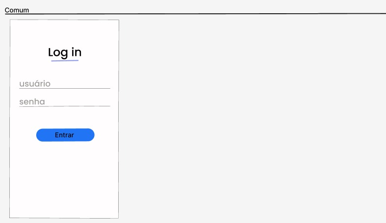
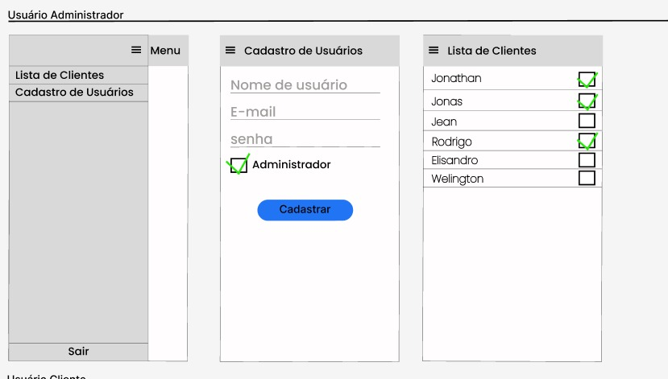
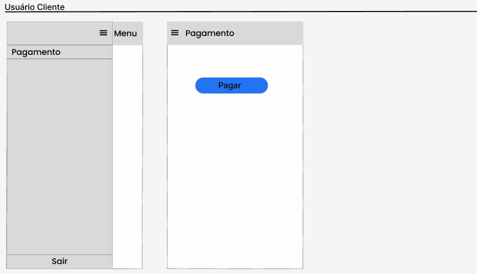

# Aplicativo de Cobrança de Água

O aplicativo de Cobrança de Água é um sistema desenvolvido para gerenciar as cobranças de contas de água de uma organização. Ele permite o cadastro de clientes, o acompanhamento dos pagamentos e oferece funcionalidades de login para diferentes tipos de usuários.

## Requisitos Funcionais

### Tela de Login
- Os usuários devem fazer login com um nome de usuário e senha.

### Menu de Usuário
- O menu deve exibir opções de funcionalidades com base no tipo de usuário (cliente ou administrador).

### Tela de Cadastro de Usuários
- A tela de cadastro de usuários só pode ser acessada por usuários administradores.
- O cadastro de usuário deve incluir informações como nome, nome de usuário, senha e tipo de usuário (cliente ou administrador).

### Listagem de Clientes para Administradores
- Os usuários administradores podem visualizar uma lista de clientes.
- A lista deve indicar se o usuário cliente pagou ou não a conta de água.

### Pagamento da Conta de Água para Clientes
- Os usuários clientes, após o login, devem ter a opção de "Pagar conta de água".

## Requisitos Não Funcionais

### Tecnologias Utilizadas
- O aplicativo será desenvolvido utilizando os frameworks Ionic e Angular.

### Backend
- Os dados serão armazenados utilizando o JSON Server, que será o nosso backend.

### Endpoints da API
- Endpoint POST para cadastro de usuário.
- Endpoint GET para listagem de usuários.
- Endpoint PUT para registro de pagamento da conta de água do usuário.
- Endpoint POST para login.
- Endpoint POST para logout.

## Protótipo

### Login (comum)

### Usuario ADM

### Usuario Cliente

## Como Usar o Aplicativo

1. Faça o download e instalação do aplicativo em seu dispositivo móvel.
2. Ao abrir o aplicativo, você será direcionado para a tela de login.
3. Insira seu nome de usuário e senha e clique em "Login".
4. Dependendo do seu tipo de usuário (cliente ou administrador), o menu exibirá as funcionalidades disponíveis para você.
5. Os administradores podem acessar a tela de cadastro de usuários e visualizar a lista de clientes.
6. Os clientes podem usar a opção "Pagar conta de água" para efetuar o pagamento.
7. Para sair do aplicativo, clique em "Logout".

## Notas de Desenvolvimento

- Certifique-se de que você está conectado à internet para usar todas as funcionalidades do aplicativo.
- O backend utiliza o JSON Server como simulador de servidor. Certifique-se de que ele esteja em execução para que o aplicativo funcione corretamente.

# Aplicativo de Cobrança de Água

O aplicativo de Cobrança de Água é um sistema desenvolvido para gerenciar as cobranças de contas de água de uma organização. Ele permite o cadastro de clientes, o acompanhamento dos pagamentos e oferece funcionalidades de login para diferentes tipos de usuários.

## Requisitos Funcionais

### Tela de Login
- Os usuários devem fazer login com um nome de usuário e senha.

### Menu de Usuário
- O menu deve exibir opções de funcionalidades com base no tipo de usuário (cliente ou administrador).

### Tela de Cadastro de Usuários
- A tela de cadastro de usuários só pode ser acessada por usuários administradores.
- O cadastro de usuário deve incluir informações como nome, nome de usuário, senha e tipo de usuário (cliente ou administrador).

### Listagem de Clientes para Administradores
- Os usuários administradores podem visualizar uma lista de clientes.
- A lista deve indicar se o usuário cliente pagou ou não a conta de água.

### Pagamento da Conta de Água para Clientes
- Os usuários clientes, após o login, devem ter a opção de "Pagar conta de água".

## Requisitos Não Funcionais

### Tecnologias Utilizadas
- O aplicativo será desenvolvido utilizando os frameworks Ionic e Angular.

### Backend
- Os dados serão armazenados utilizando o JSON Server, que será o nosso backend.

### Endpoints da API
- Endpoint POST para cadastro de usuário.
- Endpoint GET para listagem de usuários.
- Endpoint PUT para registro de pagamento da conta de água do usuário.
- Endpoint POST para login.
- Endpoint POST para logout.

## Como Usar o Aplicativo

1. Faça o download e instalação do aplicativo em seu dispositivo móvel.
2. Ao abrir o aplicativo, você será direcionado para a tela de login.
3. Insira seu nome de usuário e senha e clique em "Login".
4. Dependendo do seu tipo de usuário (cliente ou administrador), o menu exibirá as funcionalidades disponíveis para você.
5. Os administradores podem acessar a tela de cadastro de usuários e visualizar a lista de clientes.
6. Os clientes podem usar a opção "Pagar conta de água" para efetuar o pagamento.
7. Para sair do aplicativo, clique em "Logout".

## Notas de Desenvolvimento

- Certifique-se de que você está conectado à internet para usar todas as funcionalidades do aplicativo.
- O backend utiliza o JSON Server como simulador de servidor. Certifique-se de que ele esteja em execução para que o aplicativo funcione corretamente.
